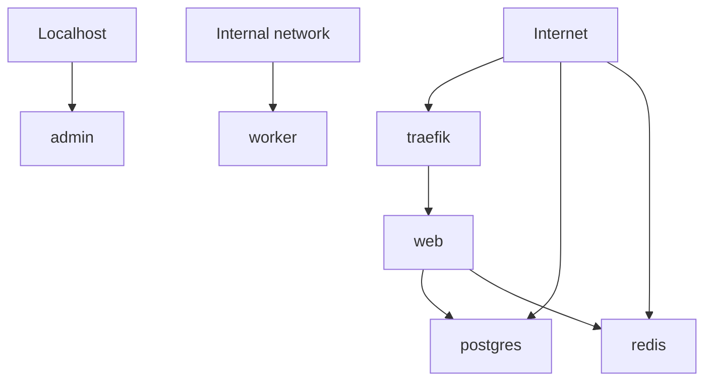

# ExposeMap

Open-source exposure mapper for self-hosted Docker Compose services.

ExposeMap scans `docker-compose.yml` files and produces local Markdown or JSON reports showing which services appear to be internal, localhost-only, directly exposed, reverse-proxy exposed, or unknown.

It is built for self-hosters, homelab users, small teams, and developers running Compose stacks on VPS, NAS, home servers, Tailscale, WireGuard, reverse proxies, or public cloud servers.

## What ExposeMap Is

ExposeMap is a lightweight, read-only configuration review tool. It parses Docker Compose files, applies simple exposure heuristics, and prints a report you can review or share with your team.

ExposeMap runs locally. It does not send your Compose files, reports, service names, labels, or infrastructure details anywhere.

## Why ExposeMap Exists

Self-hosted stacks often grow one service at a time: a database here, an admin panel there, a reverse proxy in front, maybe a VPN or tunnel later. After enough changes, it becomes hard to answer a basic question:

Which services are reachable, and how?

ExposeMap helps make that first-pass map visible from the Compose configuration you already have.

## What It Maps

- Docker Compose services
- Short syntax port mappings such as `80:80`, `5432:5432`, and `127.0.0.1:8080:8080`
- Long syntax Compose ports using `target`, `published`, and `host_ip`
- Localhost-only bindings
- Broad/public host bindings
- Likely reverse proxy services
- Traefik routing labels and obvious reverse proxy hints
- Risky directly exposed database, cache, search, and admin ports
- A Mermaid diagram of likely exposure paths
- Markdown and JSON reports for local review or CI usage

## Who It Is For

- self-hosters
- homelab users
- small teams running Docker Compose
- developers running apps on VPS, NAS, home servers, public cloud servers, Tailscale, WireGuard, or reverse proxies

## Quick Start

```bash
npm install
npm run build
node dist/cli.js scan ./docker-compose.yml --format markdown
```

When installed as a package, the CLI command is:

```bash
exposemap scan ./docker-compose.yml --format markdown
```

Markdown remains the default output:

```bash
exposemap scan ./docker-compose.yml
```

## JSON Output

Use JSON when you want CI-friendly structured output:

```bash
exposemap scan ./docker-compose.yml --format json
```

The JSON report includes tool metadata, scanned file path, generated timestamp, summary counts, services, exposure map entries, findings, and the Mermaid diagram string.

## Fail-on Thresholds

Use `--fail-on` to make ExposeMap return exit code `1` when findings at or above a chosen severity are present:

```bash
exposemap scan ./docker-compose.yml --fail-on high
exposemap scan ./docker-compose.yml --format json --fail-on medium
```

Supported values:

- `none` - always exit `0` unless CLI usage or parsing fails
- `high` - exit `1` if any high finding exists
- `medium` - exit `1` if any medium or high finding exists
- `low` - exit `1` if any low, medium, or high finding exists

The default is `none` for backward compatibility.

## Exit Codes

- `0` - scan completed and the `--fail-on` threshold was not violated
- `1` - scan completed and the `--fail-on` threshold was violated
- `2` - invalid CLI usage, unsupported options, missing files, or Compose parsing errors

## Run With Docker

```bash
docker build -t exposemap .
docker run --rm -v $(pwd):/scan exposemap scan /scan/docker-compose.yml --format markdown
```

Docker with JSON and CI threshold:

```bash
docker run --rm -v $(pwd):/scan exposemap scan /scan/docker-compose.yml --format json --fail-on high
```

## CI Usage

ExposeMap can run in CI as a lightweight Compose-based exposure review step. It runs locally in the job, does not send `docker-compose.yml` files or reports anywhere, and does not perform real network scans.

See [docs/ci-usage.md](docs/ci-usage.md) for local, Docker, JSON, and `--fail-on` examples.

Example GitHub Actions workflow:

```yaml
name: ExposeMap

on:
  pull_request:
    paths:
      - "**/docker-compose*.yml"
      - "**/compose*.yml"

jobs:
  exposemap:
    runs-on: ubuntu-latest
    steps:
      - uses: actions/checkout@v4
      - uses: actions/setup-node@v4
        with:
          node-version: 22
      - run: npm ci
      - run: npm run build
      - run: node dist/cli.js scan examples/risky-compose.yml --format json --fail-on high
```

The full example is available at [docs/github-actions-example.yml](docs/github-actions-example.yml). The example uses `examples/risky-compose.yml`, so the `--fail-on high` step is expected to fail; replace the path with your own Compose file in real CI.

## Example Report

```markdown
# ExposeMap Report

Scanned file: `examples/risky-compose.yml`

Total services: 6

## Exposure Summary

| Service | Classification | Ports | Reverse proxy hints |
| --- | --- | --- | --- |
| traefik | directly exposed | `80:80`<br>`443:443` | proxy service |
| web | reverse-proxy exposed | - | routing labels/env |
| postgres | directly exposed | `5432:5432` | - |
| redis | directly exposed | `0.0.0.0:6379:6379` | - |
```

See [examples/report.md](examples/report.md) for a generated sample.

## Mermaid Diagram Example



## Current Limitations

- No real network scanning
- No Kubernetes support
- No Cloudflare Tunnel API integration
- No Tailscale API integration
- No hosted dashboard
- Findings are heuristic checks based on Docker Compose configuration
- Reverse proxy, firewall, VPN, DNS, cloud security group, and host-level rules can change real exposure

ExposeMap does not prove real internet exposure. It does not replace a full security review, external exposure scan, firewall review, or threat model.

## Roadmap

- HTML report output
- Better reverse proxy label support
- Caddy config support
- Nginx Proxy Manager support
- Cloudflare Tunnel hints
- Tailscale checklist
- External scan integration, opt-in only
- Hosted dashboard

## Contributing

Contributions are welcome. Good first areas include parser edge cases, reverse proxy hints, report output, docs, and sanitized Compose examples.

Read [CONTRIBUTING.md](CONTRIBUTING.md) before opening a PR.

## Community

For now, GitHub issues and discussions are the best place to share examples, edge cases, and ideas. Please do not paste private Compose files, secrets, credentials, or sensitive infrastructure details into public issues.

## Hosted Dashboard / Paid Support

ExposeMap is free and open source.

A hosted SelfHostGuard Cloud dashboard may come later for teams that want:

- scheduled exposure checks
- scan history
- exposure diffs over time
- alerts when new services appear exposed
- GitHub Actions integration
- Slack / Discord alerts
- multi-stack monitoring
- team reports

This hosted dashboard does not exist yet, and ExposeMap still does not prove real internet exposure. Real external exposure testing, firewall review, DNS review, and infrastructure review remain separate work.

More context is in [docs/paid-support.md](docs/paid-support.md).

If you want early access, open an [Early Access Request](https://github.com/kozinkaihatusya/exposemap/issues/new?template=early_access_request.md).

If you need help reviewing your self-hosted exposure, reverse proxy, or Tailscale setup, open a [Setup Review Request](https://github.com/kozinkaihatusya/exposemap/issues/new?template=setup_review_request.md).

## License

ExposeMap is licensed under AGPLv3. See [LICENSE](LICENSE).
