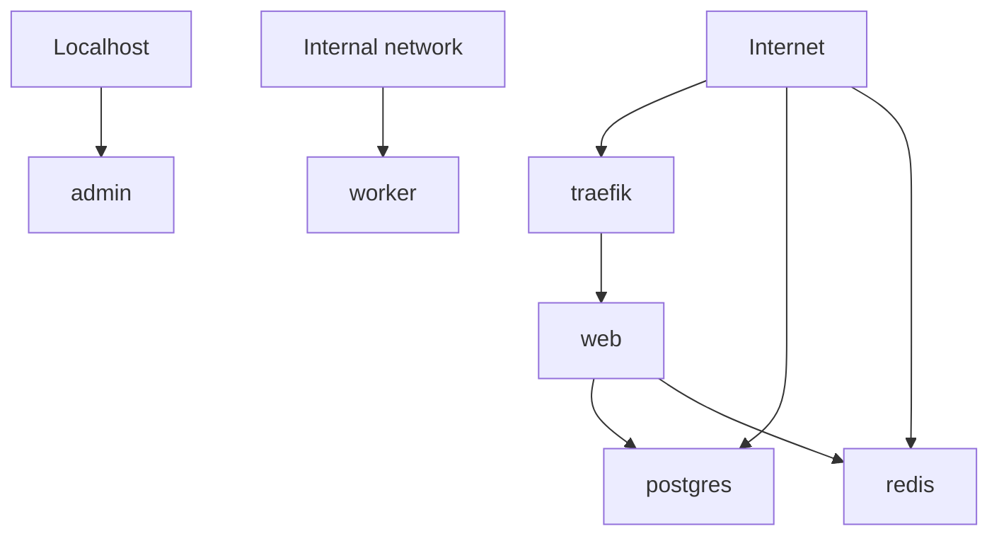

# ExposeMap

Open-source exposure mapper for self-hosted Docker Compose services.

ExposeMap scans `docker-compose.yml` files and produces a local Markdown report showing which services appear to be internal, localhost-only, directly exposed, reverse-proxy exposed, or unknown.

It is built for self-hosters, homelab users, small teams, and developers running Compose stacks on VPS, NAS, home servers, Tailscale, WireGuard, reverse proxies, or public cloud servers.

## What ExposeMap Is

ExposeMap is a lightweight, read-only configuration review tool. It parses Docker Compose files, applies simple exposure heuristics, and prints a report you can review or share with your team.

ExposeMap runs locally. It does not send your Compose files, reports, service names, labels, or infrastructure details anywhere.

## Why ExposeMap Exists

Self-hosted stacks often grow one service at a time: a database here, an admin panel there, a reverse proxy in front, maybe a VPN or tunnel later. After enough changes, it becomes hard to answer a basic question:

Which services are reachable, and how?

ExposeMap helps make that first-pass map visible from the Compose configuration you already have.

## What It Maps

- Docker Compose services
- Short syntax port mappings such as `80:80`, `5432:5432`, and `127.0.0.1:8080:8080`
- Long syntax Compose ports using `target`, `published`, and `host_ip`
- Localhost-only bindings
- Broad/public host bindings
- Likely reverse proxy services
- Traefik routing labels and obvious reverse proxy hints
- Risky directly exposed database, cache, search, and admin ports
- A Mermaid diagram of likely exposure paths

## Who It Is For

- self-hosters
- homelab users
- small teams running Docker Compose
- developers running apps on VPS, NAS, home servers, public cloud servers, Tailscale, WireGuard, or reverse proxies

## Quick Start

```bash
npm install
npm run build
node dist/cli.js scan ./docker-compose.yml --format markdown
```

When installed as a package, the CLI command is:

```bash
exposemap scan ./docker-compose.yml --format markdown
```

## Run With Docker

```bash
docker build -t exposemap .
docker run --rm -v $(pwd):/scan exposemap scan /scan/docker-compose.yml --format markdown
```

## Example Report

```markdown
# ExposeMap Report

Scanned file: `examples/risky-compose.yml`

Total services: 6

## Exposure Summary

| Service | Classification | Ports | Reverse proxy hints |
| --- | --- | --- | --- |
| traefik | directly exposed | `80:80`<br>`443:443` | proxy service |
| web | reverse-proxy exposed | - | routing labels/env |
| postgres | directly exposed | `5432:5432` | - |
| redis | directly exposed | `0.0.0.0:6379:6379` | - |
```

See [examples/report.md](examples/report.md) for a generated sample.

## Mermaid Diagram Example



## Current Limitations

- No real network scanning in the MVP
- No Kubernetes support in the MVP
- No Cloudflare Tunnel API integration in the MVP
- No Tailscale API integration in the MVP
- No hosted dashboard in the MVP
- Findings are heuristic checks based on Docker Compose configuration
- Reverse proxy, firewall, VPN, DNS, cloud security group, and host-level rules can change real exposure

ExposeMap does not prove real internet exposure. It does not replace a full security review, external exposure scan, firewall review, or threat model.

## Roadmap

- JSON report output
- HTML report output
- GitHub Actions integration
- Better reverse proxy label support
- Caddy config support
- Nginx Proxy Manager support
- Cloudflare Tunnel hints
- Tailscale checklist
- External scan integration, opt-in only
- Hosted dashboard

## Contributing

Contributions are welcome. Good first areas include parser edge cases, reverse proxy hints, report output, docs, and sanitized Compose examples.

Read [CONTRIBUTING.md](CONTRIBUTING.md) before opening a PR.

## Community

For now, GitHub issues and discussions are the best place to share examples, edge cases, and ideas. Please do not paste private Compose files, secrets, credentials, or sensitive infrastructure details into public issues.

## Hosted Version / Support Note

Hosted dashboards, scheduled exposure checks, alerts, and setup reviews may come later. If you are interested, open an issue or contact the maintainer.

## License

ExposeMap is licensed under AGPLv3. See [LICENSE](LICENSE).
