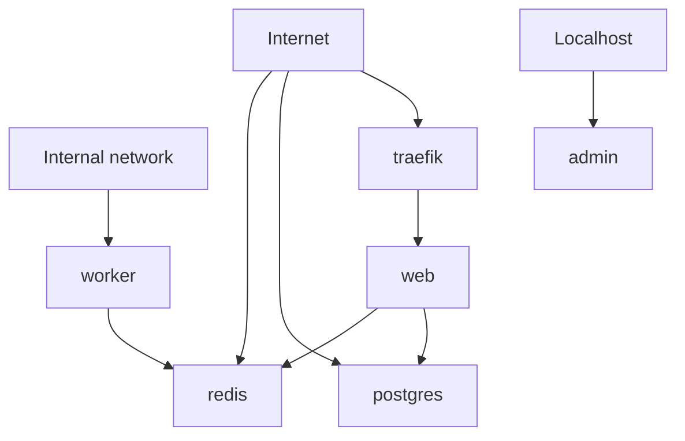

# ExposeMap Report

Scanned file: `examples/risky-compose.yml`

Total services: 6

## Exposure Summary

| Service | Classification | Ports | Reverse proxy hints |
| --- | --- | --- | --- |
| traefik | directly exposed | `80:80` `443:443` | proxy service |
| web | reverse-proxy exposed | - | routing labels/env |
| postgres | directly exposed | `5432:5432` | - |
| redis | directly exposed | `0.0.0.0:6379:6379` | - |
| admin | localhost-only | `127.0.0.1:8080:8080` | - |
| worker | internal | - | - |

## High-risk Findings

### PostgreSQL appears directly exposed

- Severity: high
- Service: `postgres`
- Rule: `risky-direct-port`
- Evidence: `5432:5432`
- Recommendation: Bind the port to localhost, remove the public port mapping, or place the service behind an intentionally configured reverse proxy/VPN path.

This service publishes a port commonly associated with databases, search backends, caches, or admin panels without a localhost-only binding.

### Redis appears directly exposed

- Severity: high
- Service: `redis`
- Rule: `risky-direct-port`
- Evidence: `0.0.0.0:6379:6379`
- Recommendation: Bind the port to localhost, remove the public port mapping, or place the service behind an intentionally configured reverse proxy/VPN path.

This service publishes a port commonly associated with databases, search backends, caches, or admin panels without a localhost-only binding.

## Service Details

### traefik

Classification: **directly exposed**

Ports:

- `80:80` (broad/public)
- `443:443` (broad/public)

Findings:

No service-specific findings.

### web

Classification: **reverse-proxy exposed**

Ports:

- No Compose `ports` entries detected.

Findings:

No service-specific findings.

### postgres

Classification: **directly exposed**

Ports:

- `5432:5432` (broad/public)

Findings:

### PostgreSQL appears directly exposed

- Severity: high
- Service: `postgres`
- Rule: `risky-direct-port`
- Evidence: `5432:5432`
- Recommendation: Bind the port to localhost, remove the public port mapping, or place the service behind an intentionally configured reverse proxy/VPN path.

This service publishes a port commonly associated with databases, search backends, caches, or admin panels without a localhost-only binding.

### redis

Classification: **directly exposed**

Ports:

- `0.0.0.0:6379:6379` (broad/public)

Findings:

### Redis appears directly exposed

- Severity: high
- Service: `redis`
- Rule: `risky-direct-port`
- Evidence: `0.0.0.0:6379:6379`
- Recommendation: Bind the port to localhost, remove the public port mapping, or place the service behind an intentionally configured reverse proxy/VPN path.

This service publishes a port commonly associated with databases, search backends, caches, or admin panels without a localhost-only binding.

### admin

Classification: **localhost-only**

Ports:

- `127.0.0.1:8080:8080` (localhost-only)

Findings:

### Service is localhost-only

- Severity: low
- Service: `admin`
- Rule: `localhost-only`
- Evidence: `127.0.0.1:8080:8080`
- Recommendation: Keep this pattern for admin tools and databases unless broader access is intentional.

All parsed port mappings are bound to localhost.

### worker

Classification: **internal**

Ports:

- No Compose `ports` entries detected.

Findings:

### Service appears internal

- Severity: low
- Service: `worker`
- Rule: `internal-service`
- Evidence: `worker`
- Recommendation: Confirm this matches the intended access path and document any VPN or proxy assumptions.

No Compose port mappings or reverse proxy routing labels were detected.

## Mermaid Diagram

## Limitations

- ExposeMap is a lightweight, read-only configuration review tool.
- Results are heuristic checks based on Docker Compose configuration.
- ExposeMap does not prove real internet exposure.
- ExposeMap does not perform real network scans.
- ExposeMap does not connect to containers or modify Compose files.
- Reverse proxy, firewall, VPN, DNS, cloud security group, and host-level rules can change real exposure.
